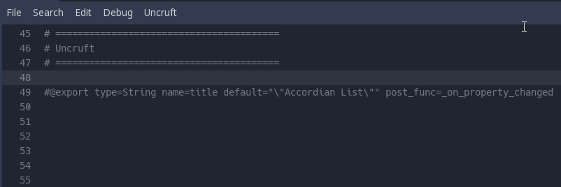

Uncruft
=======
Uncruft adds expressive macro/code generating capability to your GDScripts so you don't have to hand write large amounts of code.



## Features:
- **Flexibility**: Macros can be expanded or their expanded code cleared with 1 button press.
- **Transparent expansion and encapsulation**: Macros expand visibly in code with clear demarcations of where they start and end.
- **Optional end user usage**: Making a library or OSS? No worries, expanded macros are embedded in your code.
- **Unintrusive and backwards compatible**: You can use macros in any version of Godot and you don't even need to (re)compile the engine.
- **Expandable and customizable**: Make your own macros with the simple built in templating function or write your own templating function.

## Motivation
While GDScript is a great language with a lot of features, I found myself having to write a lot of glue code to get things to work as intended. This addon is designed specifically to solve that issue.

## Issues
Uncruft is currently in Beta, expect bugs/explosions. The API and/or macro usage language may change. **Use of a VCS is recommended!**

## Installation
Installing Uncruft is similar to installing other Godot addons. Simply download the addon via Git or Zip. Place the "uncruft" directory in the "addons" folder in your project and enable it through the addons menu.

## Macros
Macros are written with the `#@` suffix and have a fixed language structure not dissimilar to CLI applications: 
```gdscript
#@command positional_key_1=value position_key_2=value
```

# Built in macros
## export
The export macro allows you to write setget `export`s that require a function to be called after the property has been set:

### Motivation
When writing Godot `tool`s it's often imperitive that the control be updated when a property is changed in the properties toolbar. With the export macro this can be achieved quite simply without having to write multiple lines of code, copying each line for each property.

### Example
```gdscript
#@export type=String name=sword_name default="\"New Sword\"" post_func=_on_property_changed
```
Will expand to:
```gdscript
#@export type=String name=sword_name default="\"New Sword\"" post_func=_on_property_changed
export(String) var sword_name = "New Sword" setget set_prop_sword_name;
func set_prop_sword_name(v):
    sword_name = v;
    _on_property_changed("sword_name", v);
#@/export
```

# License
[MIT](LICENSE.txt)